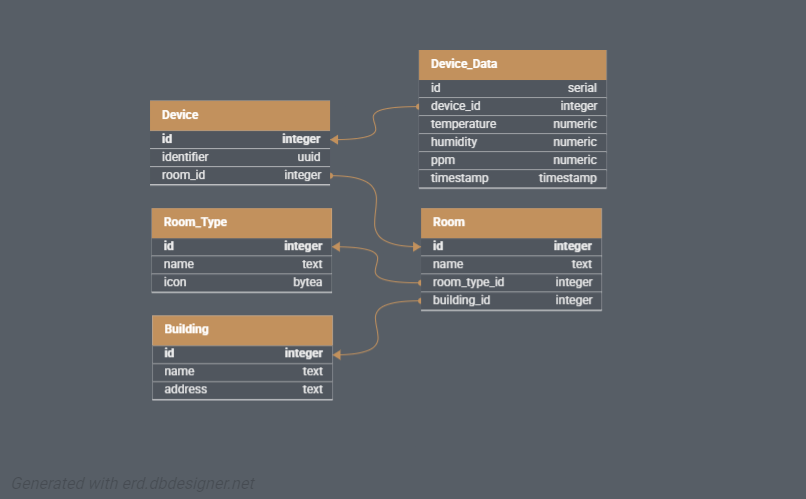

# Strapi-CMS

## Project Overview
This project is a content management system (CMS) using Strapi. In our case it's used as a database management system.

By using Strapi we get an out-of-the-box REST API for our database.

# Database Structure

The system consists of several key entities defined in the API schemas, with relationships as described below.

## Entities

### Building
- **Properties:**
  - `name`: Text
  - `address`: Text
- **Relationships:**
  - Has many rooms

---

### Room
- **Properties:**
  - `name`: Text
- **Relationships:**
  - Belongs to a `building`
  - Has a `room type`
  - Contains multiple `devices`

---

### Device
- **Properties:**
  - `identifier`: UID (Unique Identifier)
- **Relationships:**
  - Located in a `room`
  - Collects `device data`

---

### Device Data
- **Properties:**
  - `timestamp`: Datetime
  - `temperature`: Number
  - `humidity`: Number
  - `ppm`: Number
- **Relationships:**
  - Associated with a `device`

## Technology Stack
- **Database:** PostgreSQL (configurable via `docker-compose.yml`)

## Database Design



## Setup Instructions

### Prerequisites
- Node.js
- npm or yarn

### Installation
1. Clone the repository:
    ```sh
    git clone git@github.com:KempDewulf/envirosense-strapi.git
    cd strapi-cms
    ```

2. Install dependencies:
    ```sh
    npm install
    # or
    yarn install
    ```

### Environment Variables
Create a `.env` file in the root directory of your project by copying the `.env.example` file:
```sh
cp .env.example .env
```

Replace the placeholder values with your actual database credentials and JWT secret.

### Running the Project in development mode
To start the development server, run:
```sh
npm run develop
# or
yarn develop
```

### Running the Project in Production mode
To run the project in production mode, follow these steps:

1. Build the project:
    ```sh
    npm run build
    # or
    yarn build
    ```

2. Start the project:
    ```sh
    npm run start
    # or
    yarn start
    ```

Ensure that your environment variables are correctly set up in the `.env` file before starting the project in production mode.
